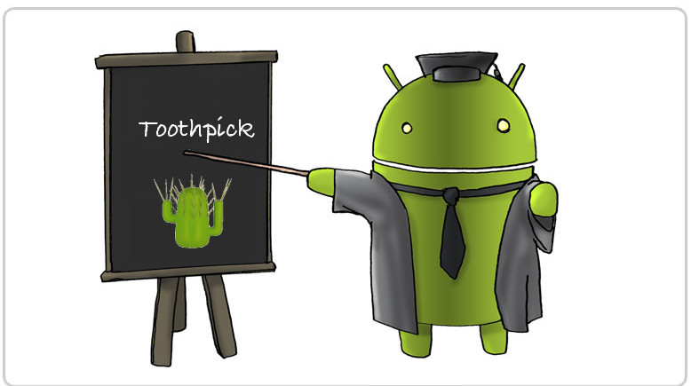

## javaToothpickWorkshop
An Android java workshop about the toothpick library. It contains an extensive list of usages of the toothpick library and some examples with instrumentation tests.

First things first:

`Thank you Stéphane Nicolas (@stephanenicolas) and Daniel Molinero (@dlemures) for this awesome library.`

 
Before looking at this project please take a look at the official documentation in https://github.com/stephanenicolas/toothpick/

These are the following examples exposed in the project:
 
#### Simple1Activity
Simple binding of interfaces `Name.class` and `Surname.class` using `toInstance` to `new NameEnglishImpl()` and `new SurnameEnglishImpl()`.

#### Simple2Activity
Simple binding of interfaces `Name.class` and `Surname.class` using `to` with implementations that have `@Inject` in the default constructor.

#### Simple3Activity
Similar than Simple2Activity but using on demand injection with `Scope#getInstance()`

#### Advanced1Activity
Using a second module to inject a class `FullNameInjectionInsideImpl.class` that opens the scope inside of the constructor.

#### Advanced2Activity
Binding the interface `FullName.class` with `ConstructorParamsFullNameImpl.class` that contains injected parameters in the constructor. Important to realize that the order of the binding does not matter.

#### Advanced3Activity
A simple module with params that binds a `Provider<FullName.class>` using `toProviderInstance`.

#### Advanced4Activity
A simple usage of `Provider<FullName.class>` that has the members injected in `InjectedFullNameProvider` without using a constructor and binding the provider using `toProvider`.

#### Advanced5Activity
Same as Advanced4Activity but now the injections happens in the constructor of `Injected2FullNameProvider.java`.

#### Advanced6Activity
Example of using named bindings (more than one class type in the scope) with `@Named("name")` and using custom qualifier annotations.

#### LibraryActivity
Using a scope defined in the `libraryDemo` module, the scope is created by calling `Singleton.getInstance()`

#### Library2Activity
Using a scope defined in the `libraryDemo` module and installing a child scope in the application that overrides the binding defined in the library.

#### SimpleActivityTest
`testWithTestModule()` uses `installTestModule` to override all bindings.
`testWithTestModuleOnlyName()` uses `installTestModule` to override only one binding.

#### LibraryActivityTest
`testNormal()` proves that the shared scope between library and application works.

#### Library2ActivityTest
`testNormal()` same as the one above.
`testChildScope()` proves that child scope implementation overrides the bindings of the parent.
